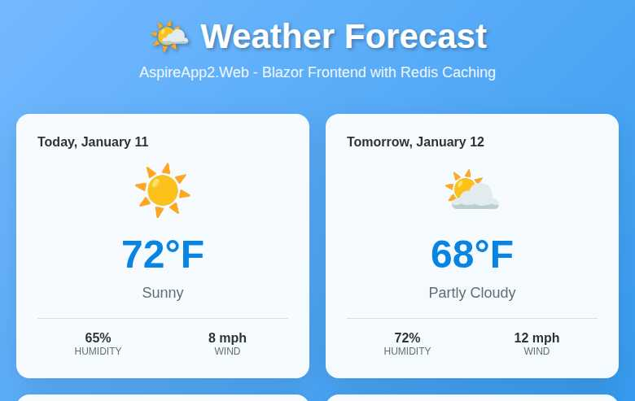

# Solution Overview

## Overview

This solution, **CopilotAspireArchitectureGeneration**, is a .NET Aspire-based distributed application designed to demonstrate how to generate architecture diagrams and documentation from an Aspire solution using prompt-driven approaches. The solution leverages modern .NET Aspire features for service orchestration, health checks, distributed tracing, and resilience.

## Goal and Purpose

The primary goal of this solution is to provide a reference implementation for:
- Building distributed applications using .NET Aspire
- Demonstrating service orchestration, health checks, and observability
- Showcasing how to document and visualize the architecture of Aspire-based solutions
- Automating architecture documentation generation using Mermaid charts

## Architecture

The solution is composed of several projects and services, orchestrated by the Aspire AppHost. The main components work together to provide a distributed weather forecast application with caching and persistence capabilities.

### Architecture Diagram (Mermaid)

```mermaid
graph TB
    %% Main orchestrator
    AppHost[AspireApp2.AppHost<br/>🎯 Orchestrator]
    
    %% Application services
    Web[AspireApp2.Web<br/>🌐 Blazor Frontend]
    API[AspireApp2.ApiService<br/>🔗 Weather API]
    
    %% External resources
    Cache[(Redis Cache<br/>⚡ Caching)]
    DB[(SQL Server<br/>🗄️ productsDb)]
    
    %% Orchestration relationships
    AppHost -.->|orchestrates| Web
    AppHost -.->|orchestrates| API
    AppHost -.->|manages| Cache
    AppHost -.->|manages| DB
    
    %% Service dependencies
    Web -->|calls| API
    Web -->|uses| Cache
    API -->|uses| DB
    
    %% Wait dependencies
    Web -.->|waits for| Cache
    Web -.->|waits for| API
    API -.->|waits for| DB
    
    %% Styling
    classDef orchestrator fill:#e1f5fe,stroke:#01579b,stroke-width:2px
    classDef service fill:#f3e5f5,stroke:#4a148c,stroke-width:2px
    classDef resource fill:#e8f5e8,stroke:#1b5e20,stroke-width:2px
    
    class AppHost orchestrator
    class Web,API service
    class Cache,DB resource
```

### Architecture Diagram (ASCII Alternative)

```
+------------------------+
|   AspireApp2.AppHost   |
|    🎯 Orchestrator     |
+------------------------+
           |
           | orchestrates & manages
           v
+------------------------+      +------------------------+
|   AspireApp2.Web       |<---->|  AspireApp2.ApiService |
|  🌐 Blazor Frontend    |      |   🔗 Weather API       |
+------------------------+      +------------------------+
           |                            |
           | uses                       | uses
           v                            v
+------------------------+      +------------------------+
|    Redis Cache         |      |   SQL Server           |
|    ⚡ Caching          |      |   🗄️ productsDb        |
+------------------------+      +------------------------+
```

## Main Components

### AspireApp2.AppHost
- **Type**: Orchestrator
- **Purpose**: Entry point and orchestrator for the distributed application
- **Responsibilities**:
  - Defines and manages the lifecycle of all services
  - Configures SQL Server with persistent volumes
  - Sets up Redis cache for performance optimization
  - Ensures correct startup order using `.WaitFor()` and `.WithReference()`
  - Manages container lifetimes and dependencies

### AspireApp2.Web
- **Type**: Frontend Application
- **Technology**: Blazor Server
- **Purpose**: User-facing web application for weather forecasts
- **Dependencies**:
  - References Redis cache for output caching
  - Calls AspireApp2.ApiService for weather data
  - Waits for both cache and API service to be ready
- **Features**:
  - Blazor-based interactive UI
  - Output caching with Redis for improved performance
  - Service discovery integration

### AspireApp2.ApiService
- **Type**: Web API
- **Technology**: Minimal API
- **Purpose**: Provides weather forecast data
- **Dependencies**:
  - References SQL Server database (productsDb)
  - Waits for database to be ready before starting
- **Features**:
  - RESTful API endpoints
  - Database integration for data persistence
  - Health checks and observability

### AspireApp2.ServiceDefaults
- **Type**: Shared Library
- **Purpose**: Provides common service defaults and configuration
- **Features**:
  - Health checks configuration
  - Service discovery setup
  - OpenTelemetry instrumentation
  - Resilience patterns
  - Consistent observability across all services

### External Resources

#### Redis Cache
- **Type**: In-memory cache
- **Purpose**: Performance optimization through output caching
- **Used by**: AspireApp2.Web
- **Configuration**: Managed by AppHost with appropriate lifetime

#### SQL Server (productsDb)
- **Type**: Relational database
- **Purpose**: Persistent storage for application data
- **Configuration**:
  - Uses SQL Server 2025-latest image
  - Persistent container lifetime
  - Data volume for persistence
  - Environment variable ACCEPT_EULA=Y
- **Used by**: AspireApp2.ApiService

## Service Dependencies and Startup Order

The solution implements a careful dependency management strategy:

1. **SQL Server** starts first (foundational data layer)
2. **Redis Cache** starts independently (caching layer)
3. **AspireApp2.ApiService** waits for SQL Server to be ready
4. **AspireApp2.Web** waits for both Redis Cache and API Service
5. **AspireApp2.AppHost** orchestrates and monitors all services

## Key Features

- **Distributed Application Orchestration**: Uses .NET Aspire for comprehensive service management
- **Health Checks**: Readiness and liveness endpoints for all services
- **Observability**: OpenTelemetry-based distributed tracing and metrics
- **Service Discovery**: Automatic service registration and discovery
- **Resilience Patterns**: Built-in fault tolerance and retry mechanisms
- **Performance Optimization**: Redis-based output caching
- **Container Management**: Proper lifetime management and resource allocation
- **Development Experience**: Comprehensive tooling and debugging support

## Technology Stack

- **.NET Aspire**: Distributed application framework
- **Blazor Server**: Frontend framework
- **Minimal API**: Lightweight API framework
- **SQL Server**: Relational database
- **Redis**: In-memory cache
- **OpenTelemetry**: Observability and tracing
- **Docker**: Containerization platform

## Intended Use

This solution serves as a comprehensive reference for:
- Developers building distributed .NET Aspire applications
- Teams implementing microservices architecture with .NET
- Organizations looking to automate architecture documentation
- Projects requiring robust observability and health monitoring
- Applications needing distributed caching and data persistence

## Development and Deployment

The solution is designed for:
- **Local Development**: Full Docker-based development environment
- **CI/CD Integration**: Automated build and deployment pipelines
- **Production Deployment**: Container orchestration platforms
- **Monitoring**: Comprehensive observability stack

---


## Screenshots

This section contains visual representations of the running Aspire application, including the dashboard and frontend components.

### Aspire Dashboard


*The Aspire dashboard showing the orchestrated services, their health status, and resource utilization.*

### Frontend Application


*The Blazor frontend application displaying the weather forecast interface.*

### Service Architecture Visualization


*Complete view of the running application architecture with all services operational.*

---


*Generated automatically from prompt-generatedoc-mermaidcharts.md on 20250711-204459*
