# Solution Overview - 20250711-210136

## Overview

This solution, **CopilotAspireArchitectureGeneration**, is a .NET Aspire-based distributed application designed to demonstrate how to generate architecture diagrams and documentation from an Aspire solution using different prompt-driven approaches.

## Goal and Purpose

CopilotAspireArchitectureGeneration - Sample code to show how to generate an architecture diagram from a .NET Aspire solution using different prompt approaches

The primary goals of this solution are:
- **Architecture Documentation**: Automatically generate comprehensive documentation with visual diagrams
- **Prompt-Driven Development**: Showcase how AI prompts can analyze and document complex distributed systems
- **Aspire Orchestration**: Demonstrate .NET Aspire's capabilities for service orchestration and management
- **Multi-Format Visualization**: Support both ASCII and Mermaid diagram formats for different use cases

## Architecture

The solution follows a distributed architecture pattern with clear separation of concerns:

### Main Components

1. **AspireApp2.AppHost** - The central orchestrator that manages the entire distributed application lifecycle
   - Configures and provisions all services and external resources
   - Manages service dependencies and startup order
   - Implements health checks and service discovery

2. **AspireApp2.Web** - A Blazor Server frontend application
   - Interactive server-side rendering with real-time updates
   - Consumes the weather API service
   - Implements Redis-based output caching for performance
   - Includes service discovery for API communication

3. **AspireApp2.ApiService** - A minimal Web API service
   - Provides weather forecast endpoints
   - Connects to SQL Server for data persistence
   - Includes health checks and OpenTelemetry instrumentation

4. **AspireApp2.ServiceDefaults** - Shared configuration library
   - Common service defaults for health checks
   - OpenTelemetry configuration
   - Service discovery setup

### External Resources

- **SQL Server Container** - Persistent database with data volumes
  - Configured with persistent lifetime
  - Uses latest 2025 image tag
  - Includes environment variables for setup

- **Redis Cache** - In-memory caching layer
  - Used for output caching in the web frontend
  - Improves performance and reduces database load

### Service Interactions

The architecture implements several key interaction patterns:

- **Service Discovery**: Web frontend discovers and communicates with API service using Aspire's built-in service discovery
- **Dependency Management**: AppHost ensures proper startup order with `WaitFor` dependencies
- **External HTTP Endpoints**: Web frontend is configured to accept external traffic
- **Caching Strategy**: Redis cache is strategically placed to optimize web frontend performance

## Architecture Diagrams

### ASCII Diagram

```
+-------------------+
|   AspireApp2      |
|    .AppHost       |
+-------------------+
         |
         | orchestrates
         v
+-------------------+      +-------------------+
| AspireApp2.Web    |<---->| AspireApp2.ApiSvc |
| (Blazor Frontend) |      | (Weather API)     |
+-------------------+      +-------------------+
         |                        ^
         | uses                   |
         v                        |
+-------------------+             |
|   Redis Cache     |<------------+
+-------------------+             |
                                  |
+-------------------+             |
|   SQL Server      |<------------+
|   (productsDb)    |
+-------------------+
```

### Mermaid Chart

```mermaid
graph TB
    %% Main orchestrator
    AppHost[AspireApp2.AppHost<br/>🎯 Orchestrator]
    
    %% Application services
    Web[AspireApp2.Web<br/>🌐 Blazor Frontend]
    API[AspireApp2.ApiService<br/>🔗 Weather API]
    
    %% External resources
    Cache[(Redis Cache<br/>⚡ Caching)]
    DB[(SQL Server<br/>🗄️ productsDb)]
    
    %% Orchestration relationships
    AppHost -.->|orchestrates| Web
    AppHost -.->|orchestrates| API
    AppHost -.->|manages| Cache
    AppHost -.->|manages| DB
    
    %% Service dependencies
    Web -->|calls| API
    Web -->|uses| Cache
    API -->|uses| DB
    
    %% Wait dependencies (from Program.cs analysis)
    Web -.->|waits for| Cache
    Web -.->|waits for| API
    API -.->|waits for| DB
    
    %% Styling
    classDef orchestrator fill:#e1f5fe,stroke:#01579b,stroke-width:2px
    classDef service fill:#f3e5f5,stroke:#4a148c,stroke-width:2px
    classDef resource fill:#e8f5e8,stroke:#1b5e20,stroke-width:2px
    
    class AppHost orchestrator
    class Web,API service
    class Cache,DB resource
```



## Features and Design Patterns

### Service Orchestration
- **Dependency Injection**: All services use .NET's built-in DI container
- **Health Checks**: Comprehensive health monitoring for all components
- **Service Discovery**: Automatic service location and communication
- **Configuration Management**: Centralized configuration through Aspire

### Performance Optimization
- **Output Caching**: Redis-based caching for improved response times
- **Async Programming**: Non-blocking operations throughout the stack
- **Connection Pooling**: Efficient database connection management

### Observability
- **Distributed Tracing**: OpenTelemetry integration for request tracking
- **Metrics Collection**: Performance and health metrics
- **Logging**: Structured logging across all services

### Development Experience
- **Hot Reload**: Development-time updates without full restarts
- **Container Integration**: Seamless Docker container management
- **Local Development**: Simplified setup for development environments

## Implementation Details

### Database Configuration
```csharp
var sql = builder.AddSqlServer("sql")
    .WithLifetime(ContainerLifetime.Persistent)
    .WithImageTag("2025-latest")
    .WithEnvironment("ACCEPT_EULA", "Y");

var productsDb = sql
    .WithDataVolume()
    .AddDatabase("productsDb");
```

### Service Dependencies
```csharp
var apiService = builder.AddProject<Projects.AspireApp2_ApiService>("apiservice")
    .WithReference(productsDb)
    .WaitFor(productsDb);

builder.AddProject<Projects.AspireApp2_Web>("webfrontend")
    .WithExternalHttpEndpoints()
    .WithReference(cache)
    .WaitFor(cache)
    .WithReference(apiService)
    .WaitFor(apiService);
```

## Intended Use

This solution serves as a reference implementation for:

1. **Learning .NET Aspire**: Understanding distributed application patterns
2. **Documentation Generation**: Automated architecture documentation workflows
3. **AI-Assisted Development**: Using prompts to analyze and document solutions
4. **Microservices Architecture**: Best practices for service communication
5. **Container Orchestration**: Modern containerized application deployment

## Technology Stack

- **.NET 9.0**: Latest .NET framework with enhanced performance
- **.NET Aspire**: Microsoft's framework for building observable, production-ready distributed applications
- **Blazor Server**: Interactive web UI framework
- **ASP.NET Core Web API**: RESTful API development
- **SQL Server**: Enterprise-grade relational database
- **Redis**: High-performance in-memory cache
- **OpenTelemetry**: Observability and monitoring
- **Docker**: Containerization for consistent deployment

---

*Documentation generated on 2025-07-11 21:01:36 following prompt instructions from prompt-generatedoc-mermaidcharts.md*
